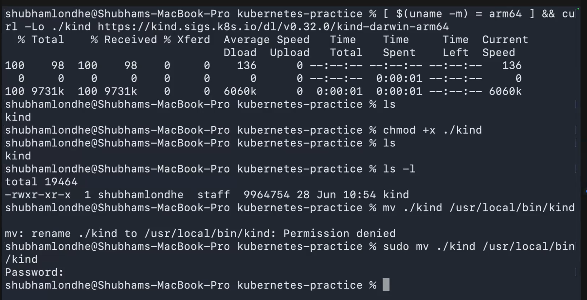
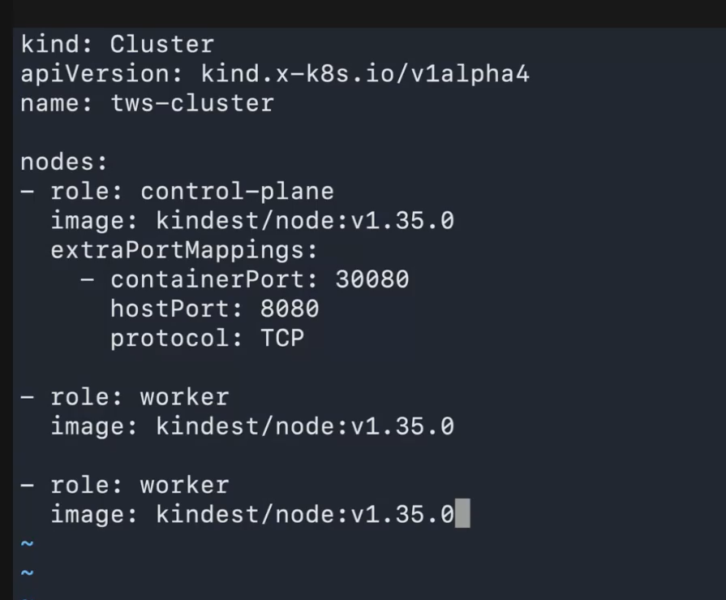
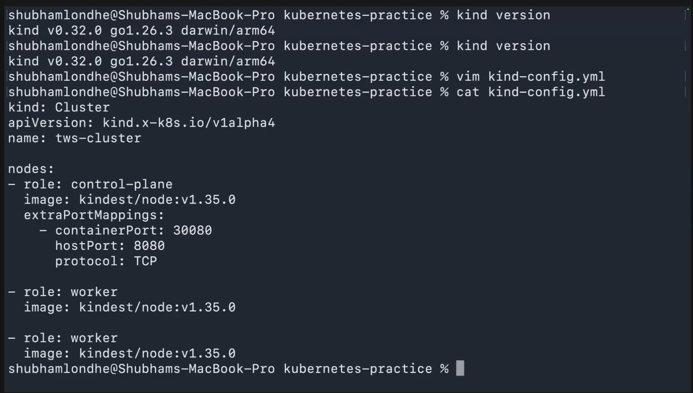
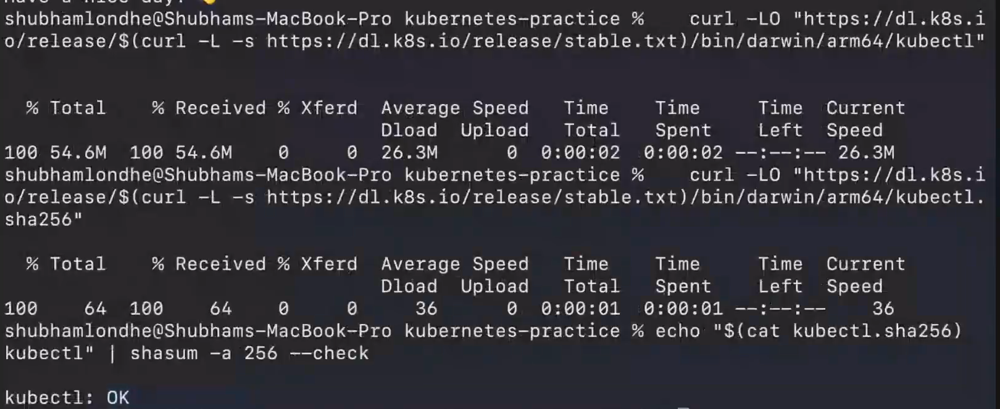
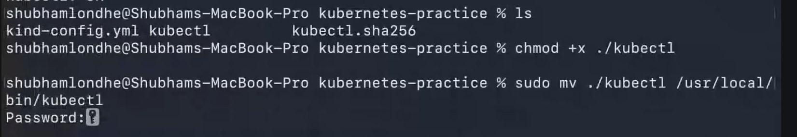
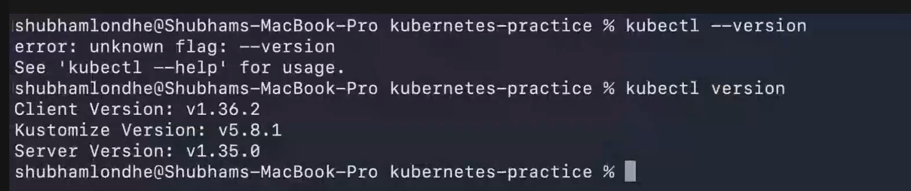
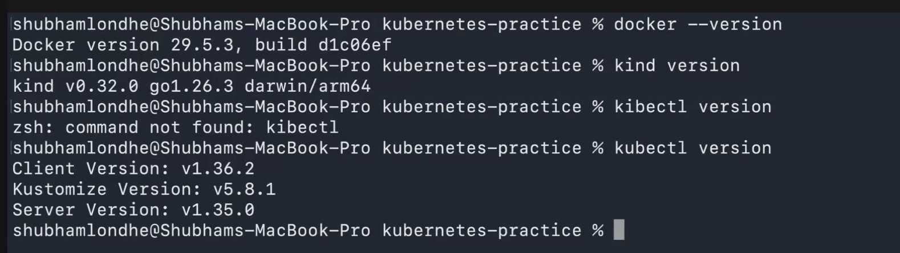
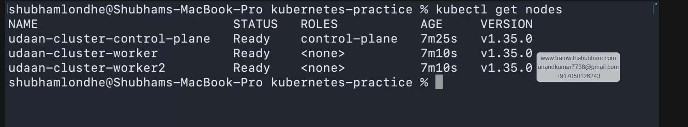
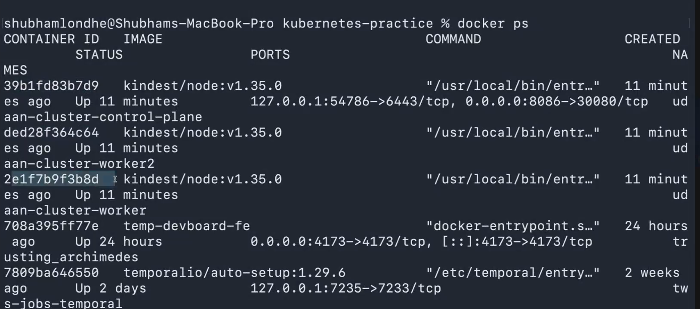
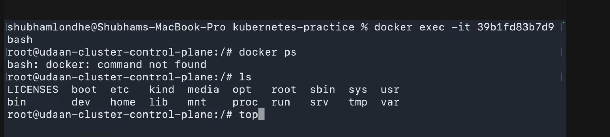
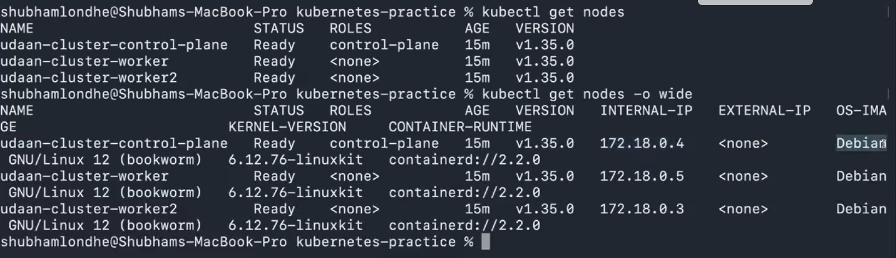
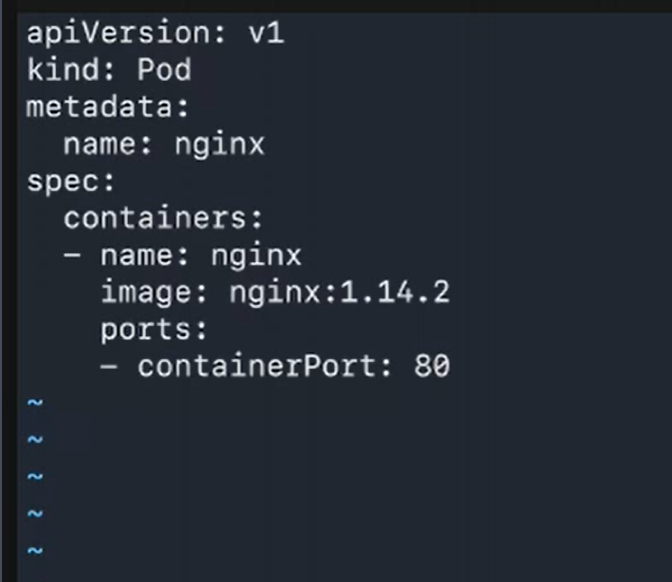
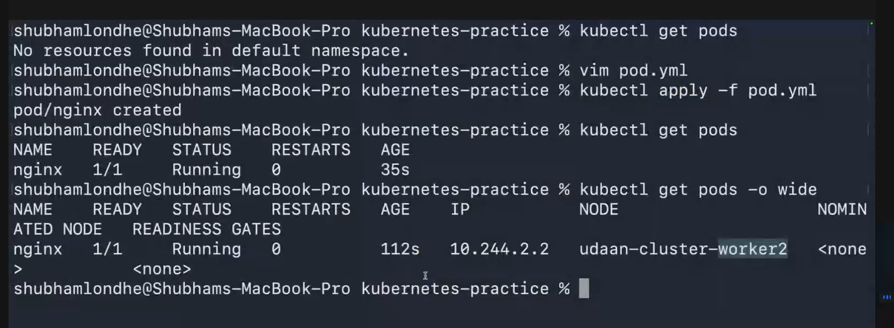
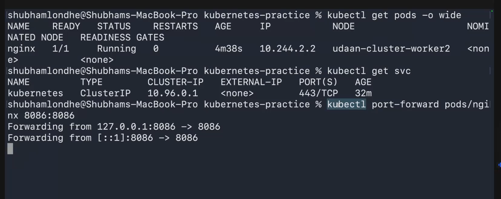
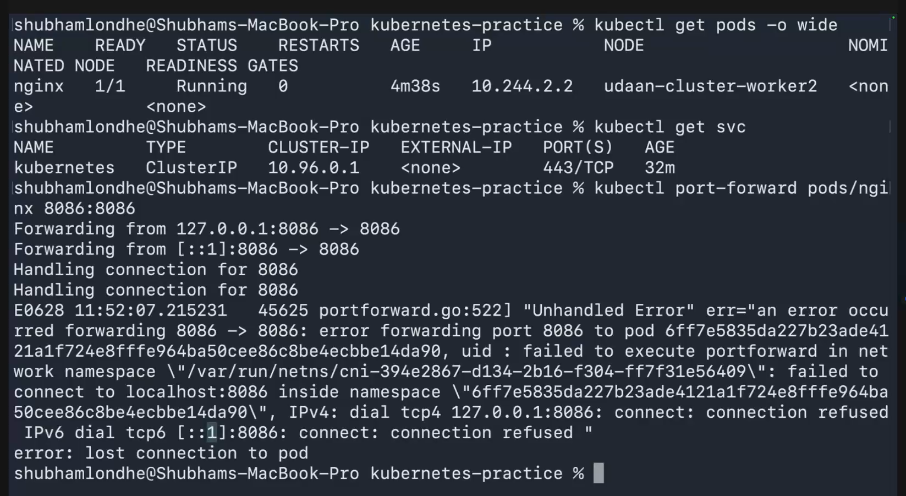
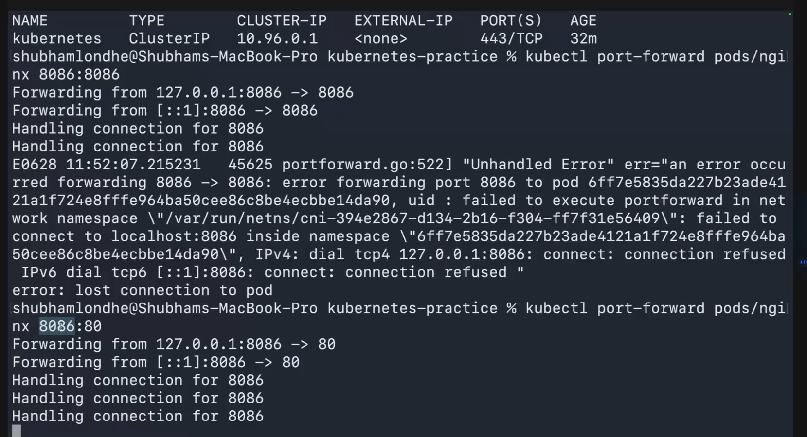
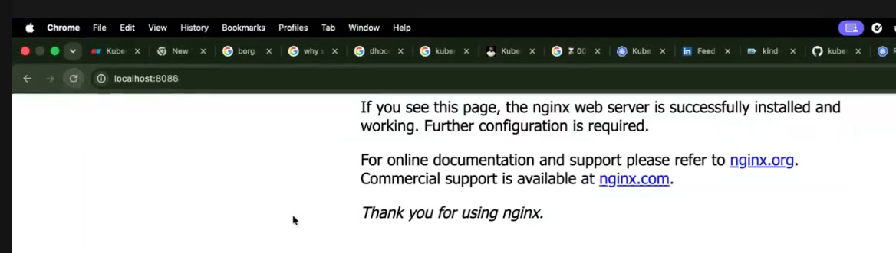
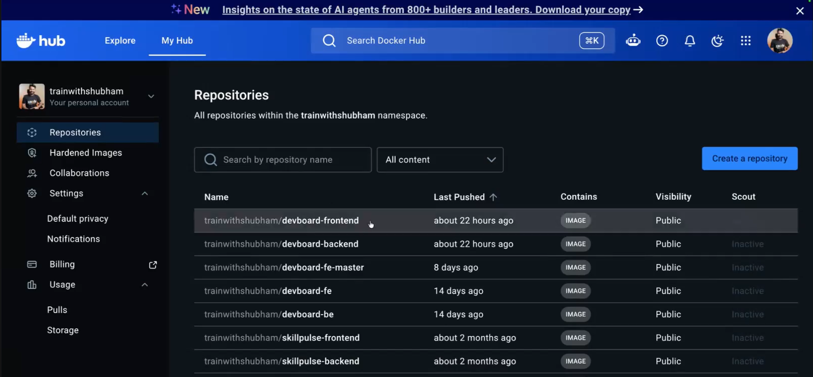
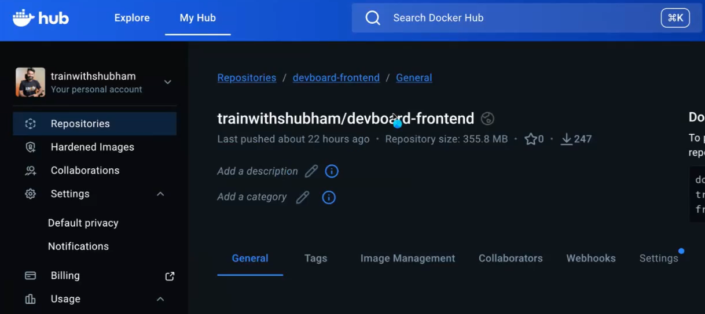
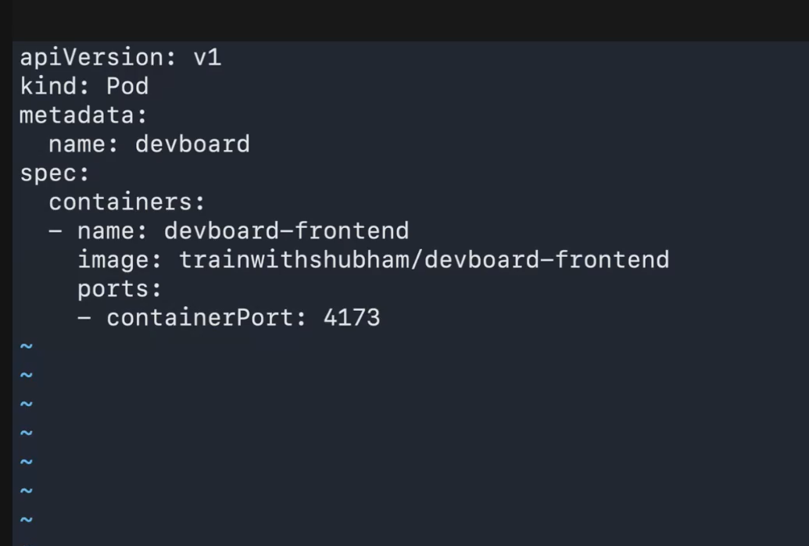
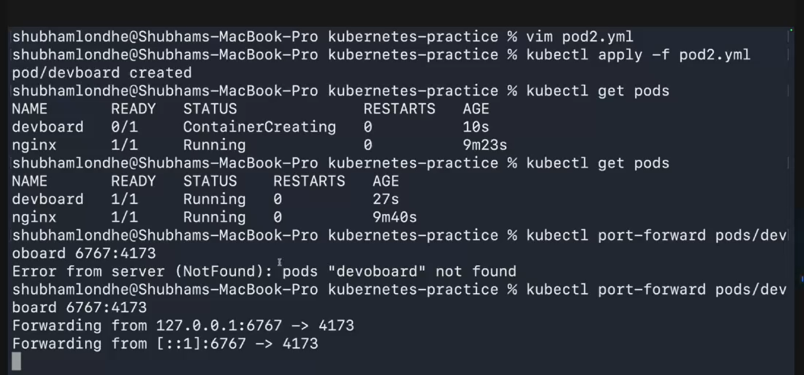
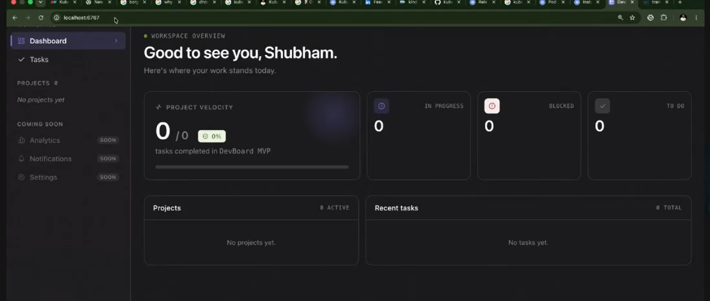
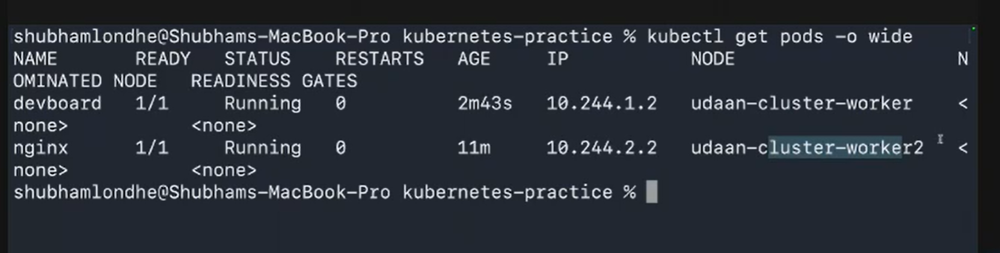
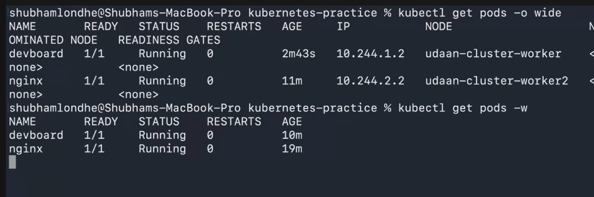


# Kubernetes Practice Notes (Kind + kubectl)

# Step 1: Install Kind

Command

```bash
curl -Lo ./kind https://kind.sigs.k8s.io/dl/v0.32.0/kind-darwin-arm64
```

## What it does

- Downloads the Kind binary.
- `curl` downloads files from the internet.
- `-L` follows redirects.
- `-o ./kind` saves the file with the name `kind` in the current directory.

Result

```
kind
```

is downloaded.

---

# Step 2: Make Kind Executable

```bash
chmod +x ./kind
```

## Explanation

`chmod`

Changes file permissions.

`+x`

Makes the file executable.

Now macOS allows you to run

```bash
./kind
```

---

# Step 3: Move Kind to System PATH

```bash
sudo mv ./kind /usr/local/bin/kind
```

## Explanation

`sudo`

Run command as administrator.

`mv`

Moves the binary.

`/usr/local/bin`

System executable folder.

Now you can execute

```bash
kind
```

from anywhere.

---

# Step 4: Verify Installation

```bash
kind version
```

Output

```text
kind v0.32.0
```

Meaning

Kind is installed successfully.

---

# Step 5: Create kind-config.yml

```yaml
kind: Cluster
apiVersion: kind.x-k8s.io/v1alpha4

name: tws-cluster

nodes:
- role: control-plane
  image: kindest/node:v1.35.0

  extraPortMappings:
  - containerPort: 30080
    hostPort: 8080
    protocol: TCP

- role: worker
  image: kindest/node:v1.35.0

- role: worker
  image: kindest/node:v1.35.0
```

---

# YAML Explanation

## kind

```yaml
kind: Cluster
```

Tells Kind to create a Kubernetes Cluster.

---

## apiVersion

```yaml
apiVersion: kind.x-k8s.io/v1alpha4
```

Specifies the Kind configuration API version.

---

## name

```yaml
name: tws-cluster
```

Cluster name.

Docker containers will be created like

```
tws-cluster-control-plane

tws-cluster-worker

tws-cluster-worker2
```

---

## nodes

```yaml
nodes:
```

Defines all Kubernetes nodes.

---

## Control Plane

```yaml
- role: control-plane
```

Creates the Kubernetes Master Node.

Runs

- API Server
- Scheduler
- Controller Manager
- ETCD

---

## Worker

```yaml
- role: worker
```

Creates Worker Node.

Runs

- kubelet
- kube-proxy
- Pods

---

## image

```yaml
image: kindest/node:v1.35.0
```

Uses Kubernetes version 1.35.0.

---

## extraPortMappings

```yaml
extraPortMappings:
```

Maps ports from Docker container to your laptop.

Example

```yaml
containerPort:30080

hostPort:8080
```

Means

```
localhost:8080

↓

NodePort 30080
```

---

# Step 6: Install kubectl

```bash
curl -LO https://dl.k8s.io/...
```

Downloads kubectl.

---

## Verify checksum

```bash
echo "$(cat kubectl.sha256) kubectl" | shasum -a 256 --check
```

Purpose

Checks the downloaded file is authentic.

Output

```
kubectl: OK
```

---

## Make Executable

```bash
chmod +x kubectl
```

Makes kubectl executable.

---

## Move

```bash
sudo mv kubectl /usr/local/bin/
```

Now kubectl works globally.

---

## Verify

```bash
kubectl version
```

Output

```
Client Version

Server Version
```

Meaning

Client

Your kubectl version.

Server

Kubernetes Cluster version.

---

# Step 7: Docker Version

```bash
docker --version
```

Checks Docker installation.

---

# Step 8: List Nodes

```bash
kubectl get nodes
```

Output

```
control-plane

worker

worker2
```

Meaning

Cluster has

- 1 Control Plane
- 2 Worker Nodes

---

# Step 9: Docker Containers

```bash
docker ps
```

Shows Kind nodes as Docker containers.

Example

```
udaan-cluster-control-plane

udaan-cluster-worker

udaan-cluster-worker2
```

Each Kubernetes node is actually a Docker container.

---

# Step 10: Login into Control Plane

```bash
docker exec -it <container-id> bash
```

Example

```bash
docker exec -it 39b1fd83b7d9 bash
```

Now you're inside the Control Plane container.

---

# Why "docker: command not found"?

Inside the Kind node, Docker isn't installed.

Kind uses **containerd** internally, not Docker.

---

# Step 11: Create First Pod

pod.yml

```yaml
apiVersion: v1

kind: Pod

metadata:
  name: nginx

spec:
  containers:
  - name: nginx
    image: nginx:1.14.2

    ports:
    - containerPort: 80
```

---

# YAML Explanation

## apiVersion

```yaml
apiVersion: v1
```

Core Kubernetes API.

---

## kind

```yaml
kind: Pod
```

Creates one Pod.

---

## metadata

```yaml
metadata:
  name: nginx
```

Pod name.

---

## spec

Defines desired state.

---

## containers

Pod contains containers.

---

## image

```yaml
image: nginx:1.14.2
```

Downloads nginx image.

---

## containerPort

```yaml
containerPort:80
```

Container listens on port 80.

---

# Create Pod

```bash
kubectl apply -f pod.yml
```

Meaning

Apply configuration.

Output

```
pod/nginx created
```

---

# List Pods

```bash
kubectl get pods
```

Output

```
nginx Running
```

---

# Detailed Pod Information

```bash
kubectl get pods -o wide
```

Shows

- Pod IP
- Node
- Internal IP
- Age

Example

```
Pod

↓

IP

↓

10.244.2.2

↓

Worker2
```

---

# List Services

```bash
kubectl get svc
```

Output

```
kubernetes ClusterIP
```

This is the default Kubernetes API service.

---

# Port Forward

Wrong

```bash
kubectl port-forward pods/nginx 8086:8086
```

Failed because nginx listens on port **80**, not **8086**.

Error

```
connection refused
```

Correct

```bash
kubectl port-forward pod/nginx 8086:80
```

Meaning

```
Laptop Port

8086

↓

Pod Port

80
```

Open

```
http://localhost:8086
```

Shows the Nginx welcome page.

---

# Create Second Pod

pod2.yml

```yaml
apiVersion: v1

kind: Pod

metadata:
  name: devboard

spec:
  containers:
  - name: devboard-frontend
    image: trainwithshubham/devboard-frontend

    ports:
    - containerPort: 4173
```

Explanation

- Creates a Pod named `devboard`.
- Pulls the image `trainwithshubham/devboard-frontend`.
- The application listens on port **4173**.

Deploy

```bash
kubectl apply -f pod2.yml
```

Initially

```
ContainerCreating
```

means Kubernetes is downloading the image.

Later

```
Running
```

means the Pod is ready.

---

# Access Devboard

Incorrect

```bash
kubectl port-forward pods/devoboard 6767:4173
```

The Pod name was misspelled (`devoboard`).

Correct

```bash
kubectl port-forward pod/devboard 6767:4173
```

Open

```
http://localhost:6767
```

to view the application.

---

# Watch Pods

```bash
kubectl get pods -w
```

`-w` means **watch**.

Whenever a Pod is created, deleted, or changes status, the output updates automatically.

---

# Command Summary

| Command | Purpose |
|---------|---------|
| `kind version` | Check Kind version |
| `kubectl version` | Check kubectl and cluster version |
| `kubectl get nodes` | List all cluster nodes |
| `kubectl get pods` | List Pods |
| `kubectl get pods -o wide` | Show Pod IP and Node |
| `kubectl get svc` | List Services |
| `kubectl apply -f file.yml` | Create or update resources |
| `kubectl port-forward pod/<name> LOCAL:CONTAINER` | Access a Pod locally |
| `kubectl get pods -w` | Watch Pod status live |
| `docker ps` | List Docker containers |
| `docker exec -it <id> bash` | Open a shell inside a Kind node |
| `chmod +x` | Make a file executable |
| `sudo mv` | Move a file into the system PATH |

# Key Concepts

- **Kind** creates a Kubernetes cluster using Docker containers.
- Each **Kind node** (control plane or worker) is itself a Docker container.
- **kubectl** communicates with the Kubernetes API Server.
- **YAML files** describe the desired state of Kubernetes resources.
- A **Pod** is the smallest deployable unit in Kubernetes.
- **containerPort** is the port your application listens on inside the container.
- **port-forward** temporarily maps a local port to a Pod's port so you can access the application from your browser.


.........................................................................................................


.............................................................................................................

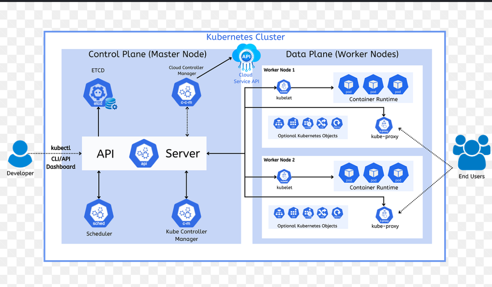

```txt

Kubernetes Cluster
│
├── Control Plane
│   ├── API Server
│   ├── etcd
│   ├── Scheduler
│   ├── Controller Manager
│   └── Cloud Controller Manager
│
└── Worker Nodes
    │
    ├── Worker Node 1
    │   ├── kubelet
    │   ├── kube-proxy
    │   └── Pods
    │       ├── Pod A
    │       │   ├── Container 1
    │       │   └── Container 2
    │       │
    │       └── Pod B
    │           └── Container 1
    │
    └── Worker Node 2
        ├── kubelet
        ├── kube-proxy
        └── Pods
            ├── Pod C
            │   └── Container 1
            │
            └── Pod D
                └── Container 1

```
# ☸️ Kubernetes Cluster Architecture (Beginner to Advanced Guide)

> **Kubernetes (K8s)** is an open-source **Container Orchestration Platform** that automates the deployment, scaling, networking, and management of containerized applications.

---

# 📚 Table of Contents

1. What is Kubernetes?
2. Kubernetes Cluster Architecture
3. Control Plane (Master Node)
4. Data Plane (Worker Nodes)
5. Developer Workflow
6. API Server
7. ETCD
8. Scheduler
9. Controller Manager
10. Cloud Controller Manager
11. Worker Nodes
12. kubelet
13. Container Runtime
14. Pods
15. Kubernetes Objects
16. kube-proxy
17. End User Flow
18. Complete Request Flow
19. Easy Interview Revision

---

# ☸️ What is Kubernetes?

Imagine a company has many Linux servers.

Instead of manually logging into every server to deploy applications, Kubernetes manages all servers automatically.

```text
                Kubernetes Cluster

        +------------------------------------+
        |                                    |
        |      Kubernetes Manager            |
        |                                    |
        +------------------------------------+
                 │
     ┌───────────┼────────────┐
     ▼           ▼            ▼
  Worker1     Worker2      Worker3
```

Kubernetes performs:

- Automatic Deployment
- Automatic Scaling
- Self-Healing
- Load Balancing
- Rolling Updates
- Monitoring

---

# 🏢 Kubernetes Cluster Architecture

The entire blue box in the architecture represents one **Kubernetes Cluster**.

```text
+--------------------------------------------------------+
|                Kubernetes Cluster                      |
|                                                        |
|      Control Plane          Data Plane                 |
|      (Master Node)        (Worker Nodes)               |
+--------------------------------------------------------+
```

The cluster has two major parts.

## 🧠 Control Plane (Master Node)

The brain of Kubernetes.

Responsibilities

- Makes decisions
- Schedules Pods
- Stores Cluster Information
- Maintains Desired State

---

## 💪 Data Plane (Worker Nodes)

The workers.

Responsibilities

- Run Containers
- Run Pods
- Execute Application
- Handle Networking

---

## Company Example

Think of Kubernetes like a software company.

| Company | Kubernetes |
|----------|------------|
| CEO | Control Plane |
| Employees | Worker Nodes |
| Office Database | ETCD |
| HR Manager | Scheduler |
| Supervisor | Controller Manager |

The CEO decides.

Employees do the work.

---

# 👨‍💻 Step 1 — Developer

The developer creates the application.

Example

```
Frontend (React)

Backend (NodeJS)

Database (MySQL)
```

Then creates Kubernetes YAML.

Example

```yaml
apiVersion: apps/v1
kind: Deployment
metadata:
  name: frontend
```

Deployment command

```bash
kubectl apply -f deployment.yaml
```

---

# 🖥 Step 2 — kubectl

kubectl is the Kubernetes Command Line Tool.

Flow

```text
Developer

↓

kubectl

↓

API Server
```

Think of kubectl as a waiter.

You give your order to the waiter.

The waiter takes it to the kitchen.

Similarly

```
Developer

↓

kubectl

↓

API Server
```

kubectl never creates Pods.

It only sends requests.

Common commands

```bash
kubectl apply

kubectl get pods

kubectl get nodes

kubectl delete pod

kubectl describe pod

kubectl logs
```

---

# 🚪 Step 3 — API Server

The API Server is the heart of Kubernetes.

Everything goes through the API Server.

```text
Developer

↓

kubectl

↓

API Server

↓

Entire Cluster
```

Responsibilities

- Accept API Requests
- Authenticate User
- Authorize User
- Validate Requests
- Store Data into ETCD
- Communicate with Scheduler
- Communicate with Controller Manager
- Communicate with Worker Nodes

Think of it as the **Reception Desk** or **CEO Office**.

Nobody enters without permission.

---

# 💾 Step 4 — ETCD

ETCD is Kubernetes Database.

It stores everything.

Examples

```
Pods

Deployments

Nodes

Namespaces

Secrets

ConfigMaps

Cluster State

Pod IP

Replica Count
```

Example

```
Frontend Pod

Status = Running

IP = 10.244.0.15

Node = Worker-2
```

ETCD stores all this information.

Think of ETCD as the brain memory.

Without ETCD

Kubernetes forgets everything.

---

# 📋 Step 5 — Scheduler

Scheduler decides

**Which Worker Node should run the Pod?**

Example

```
Worker1 CPU = 90%

Worker2 CPU = 15%

Worker3 CPU = 65%
```

Scheduler selects

```
Worker2
```

because it has enough resources.

Scheduler checks

- CPU
- RAM
- Taints
- Affinity
- Labels
- Available Resources

Scheduler never creates Pods.

It only chooses the best node.

---

# 👨‍💼 Step 6 — Controller Manager

Controller Manager continuously checks

```
Desired State

vs

Current State
```

Example

Desired

```
Frontend = 3 Pods
```

Current

```
Frontend = 2 Pods
```

Controller Manager detects

```
1 Pod Missing
```

Immediately creates another Pod.

Think of Controller Manager as a supervisor.

---

# ☁️ Step 7 — Cloud Controller Manager

Only used in Cloud.

Examples

- AWS
- Azure
- Google Cloud

It manages

- Load Balancer
- Storage
- Virtual Machines
- Cloud Networking
- Public IP

Example

You create

```yaml
type: LoadBalancer
```

Cloud Controller Manager asks AWS

```
Create Load Balancer
```

AWS creates it automatically.

---

# 💪 Step 8 — Worker Nodes

Worker Nodes actually run applications.

Example

```text
Worker Node

kubelet

kube-proxy

containerd

Pods
```

Worker Nodes never make decisions.

They execute instructions.

---

# 🤖 Step 9 — kubelet

kubelet is the Kubernetes Agent.

Every Worker Node has one kubelet.

Flow

```
API Server

↓

kubelet

↓

Container Runtime

↓

Pod Created
```

Example

API Server says

```
Run Frontend
```

kubelet tells containerd

```
Create Pod
```

---

# 📦 Step 10 — Container Runtime

Container Runtime actually runs containers.

Examples

- Docker
- containerd
- CRI-O

Responsibilities

- Pull Images
- Start Containers
- Stop Containers
- Restart Containers

Without Container Runtime

Pods cannot run.

---

# 📱 Step 11 — Pod

Pod is the smallest deployable unit.

Example

```
Frontend Pod

Backend Pod

Database Pod

Redis Pod
```

A Pod contains

```
One Container

or

Multiple Containers
```

Example

```
Frontend Pod

↓

React Container
```

---

# 📦 Step 12 — Kubernetes Objects

Optional Kubernetes Objects

- Pod
- ReplicaSet
- Deployment
- Service
- Namespace
- StatefulSet
- DaemonSet
- Job
- CronJob
- ConfigMap
- Secret
- Ingress

These objects tell Kubernetes how to manage Pods.

---

# 🌐 Step 13 — kube-proxy

kube-proxy manages networking.

Flow

```
User

↓

Service

↓

kube-proxy

↓

Pod
```

Responsibilities

- Load Balancing
- Service Routing
- Network Rules

Think of kube-proxy as Traffic Police.

---

# 👤 Step 14 — End User

End users use the application.

Example

```
www.netflix.com
```

Flow

```
User

↓

Load Balancer

↓

Service

↓

kube-proxy

↓

Frontend Pod

↓

Backend Pod

↓

Database

↓

Response
```

Users never access Pods directly.

---

# 🚀 Complete Request Flow

```text
Developer
    │
    ▼
kubectl apply -f deployment.yaml
    │
    ▼
API Server
    │
    ├────────► ETCD
    │
    ├────────► Scheduler
    │
    ├────────► Controller Manager
    │
    └────────► kubelet
                  │
                  ▼
          Container Runtime
                  │
                  ▼
               Pod Created
                  │
                  ▼
             kube-proxy
                  │
                  ▼
               End User
```

---

# 🧠 Easy Interview Revision

| Component | Purpose | Easy Analogy |
|------------|---------|--------------|
| Kubernetes Cluster | Collection of Nodes | Company |
| Control Plane | Makes Decisions | 🧠 Brain |
| API Server | Entry Point | 🚪 Reception |
| ETCD | Cluster Database | 💾 Memory |
| Scheduler | Chooses Node | 📋 HR Manager |
| Controller Manager | Maintains Desired State | 👨‍💼 Supervisor |
| Cloud Controller Manager | Cloud Resources | ☁️ Cloud Admin |
| Worker Node | Runs Applications | 💪 Employee |
| kubelet | Worker Agent | 🤖 Robot |
| Container Runtime | Runs Containers | 📦 Engine |
| Pod | Smallest Deployable Unit | 📱 Running App |
| kube-proxy | Networking | 🚦 Traffic Police |
| Service | Stable Network Endpoint | 📡 Reception Desk |
| Deployment | Manages Pods | 📄 Manager |
| ReplicaSet | Maintains Pod Count | 🔁 Auto Replacement |
| End User | Uses Application | 👤 Customer |

---

# 🎯 Key Points

- Kubernetes is a Container Orchestration Platform.
- A Kubernetes Cluster consists of a Control Plane and Worker Nodes.
- The API Server is the entry point to the cluster.
- ETCD stores the complete cluster state.
- The Scheduler selects the best Worker Node for new Pods.
- The Controller Manager maintains the desired state of the cluster.
- The Cloud Controller Manager integrates Kubernetes with cloud providers.
- Worker Nodes execute workloads and run application Pods.
- kubelet receives instructions from the Control Plane and starts Pods.
- The Container Runtime (containerd, Docker, or CRI-O) runs containers.
- A Pod is the smallest deployable unit in Kubernetes.
- kube-proxy provides networking and routes traffic to the correct Pods.
- End users access applications through Services and Load Balancers, not directly through Pods.


................................................................................................................
.................................................................................................................
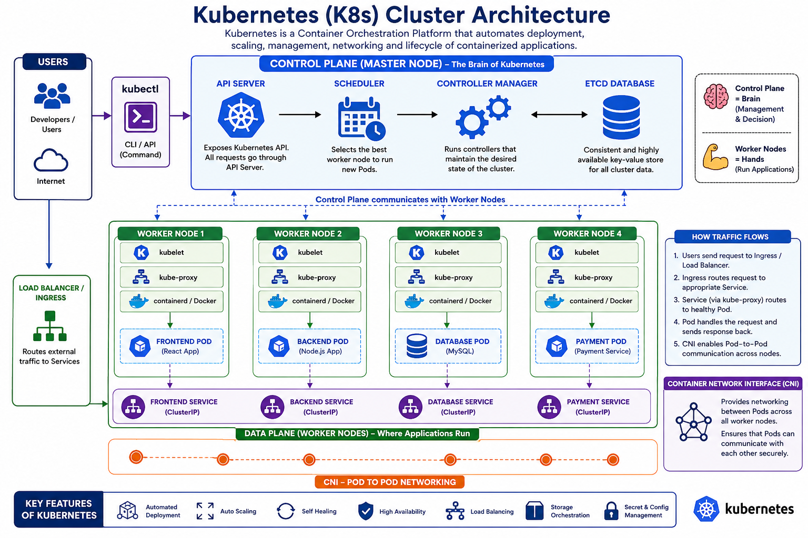
#☸️ Kubernetes Cluster Architecture (Simple Explanation)

## 📖 Introduction

Think of **Kubernetes (K8s)** as a **manager** that controls multiple Linux servers (called **Nodes**) running Docker or containerd containers.

Instead of logging into each server manually, Kubernetes automatically deploys, scales, monitors, and recovers applications across the cluster.

---

# What is a Kubernetes Cluster?

A **Kubernetes Cluster** is a group of servers (**Nodes**) connected together and managed by Kubernetes.

```text
                   Kubernetes Cluster
       +---------------------------------------+

          Control Plane (Master Node)
                     │
        ---------------------------------
        │        │        │        │
        ▼        ▼        ▼        ▼
     Worker1  Worker2  Worker3  Worker4
        │        │        │        │
     Docker   Docker   Docker   Docker
    Frontend Backend Database Payment

       +---------------------------------------+
```

Each Worker Node is an independent Linux server.

Example

```
Worker Node 1 → EC2 Instance
Worker Node 2 → EC2 Instance
Worker Node 3 → EC2 Instance
Worker Node 4 → EC2 Instance
Worker Node 5 → EC2 Instance
```

If your company has **10 servers**, Kubernetes manages all of them from one **Control Plane**.

Instead of logging into every server:

```bash
ssh server1
ssh server2
ssh server3
ssh server4
```

You simply execute:

```bash
kubectl apply -f deployment.yaml
```

Kubernetes deploys the application automatically to the best available worker nodes.

---

# Why Kubernetes?

Imagine a company with **10 servers**.

```
Node1
Node2
Node3
Node4
Node5
Node6
Node7
Node8
Node9
Node10
```

## Without Kubernetes

- Login to every server manually
- Install Docker manually
- Run containers manually
- Restart failed containers manually
- Scale applications manually
- Monitor each server individually

Very difficult to manage.

---

## With Kubernetes

```text
            Kubernetes
                 │
      -------------------------
      │   │   │   │   │
    Node1 Node2 Node3 Node4 Node5
```

Everything is managed automatically.

- Automatic deployment
- Automatic scaling
- Automatic recovery
- Automatic scheduling
- High availability

---

# Is Kubernetes a Container?

**No.**

Docker (or containerd) actually runs containers.

```text
Docker
   │
Runs Containers
```

Kubernetes **does not create containers**.

Instead, it tells Docker/containerd:

- Where to run containers
- When to run containers
- How many containers should run
- When to restart containers

---

# Docker vs Kubernetes

| Docker | Kubernetes |
|---------|------------|
| Runs containers | Manages containers |
| Single server | Multiple servers |
| Manual scaling | Automatic scaling |
| Manual recovery | Self-healing |
| No orchestration | Full orchestration |

---

## Example

### Without Kubernetes

```text
Docker

Frontend Container
Backend Container
Database Container
```

Backend crashes

```
❌ Manual restart required
```

---

### With Kubernetes

```
Backend crashes

↓

Kubernetes detects failure

↓

Creates new Backend Pod

↓

Application continues
```

---

# Kubernetes Architecture

```text
                          USER
                            │
                     kubectl Command
                            │
                            ▼
                    +----------------+
                    |   API Server   |
                    +----------------+
                           │
      -------------------------------------------------
      │               │             │                 │
      ▼               ▼             ▼                 ▼
 Scheduler      Controller     ETCD Database     Authentication
                 Manager        (Cluster Data)

               ===== CONTROL PLANE =====
```

The **Control Plane** manages the cluster.

---

# Worker Nodes (Data Plane)

```text
             Worker Node 1
        +-----------------------+
        | kubelet               |
        | kube-proxy            |
        | Docker/containerd     |
        | Frontend Container    |
        +-----------------------+

             Worker Node 2
        +-----------------------+
        | kubelet               |
        | kube-proxy            |
        | Docker/containerd     |
        | Backend Container     |
        +-----------------------+

             Worker Node 3
        +-----------------------+
        | kubelet               |
        | kube-proxy            |
        | Docker/containerd     |
        | Database Container    |
        +-----------------------+

             Worker Node 4
        +-----------------------+
        | kubelet               |
        | kube-proxy            |
        | Docker/containerd     |
        | Payment Container     |
        +-----------------------+
```

Worker Nodes actually run your application.

---

# Control Plane Components

```text
                    Control Plane

               +----------------------+
               |      API Server      |
               +----------------------+
                        │
      --------------------------------------------
      │                │                 │
      ▼                ▼                 ▼
 Scheduler     Controller Manager      ETCD
```

---

# 1️⃣ API Server

The **API Server** is the entry point of Kubernetes.

Everything goes through the API Server.

```
kubectl apply

↓

API Server

↓

Cluster
```

Responsibilities

- Accepts API requests
- Validates requests
- Communicates with ETCD
- Talks to Scheduler
- Talks to Controller Manager
- Talks to Worker Nodes

---

# 2️⃣ Scheduler

The Scheduler decides:

> Which Worker Node should run the new Pod?

Example

```
Worker1 CPU = 90%

Worker2 CPU = 20%

Worker3 CPU = 50%
```

Scheduler chooses

```
Worker2
```

because it has sufficient resources.

---

# 3️⃣ Controller Manager

Controller Manager continuously compares:

```
Desired State

vs

Current State
```

Example

Desired

```
Frontend = 3 Pods
```

Current

```
Frontend = 2 Pods
```

Controller Manager notices one Pod is missing and immediately creates another.

---

# 4️⃣ ETCD

ETCD is Kubernetes' distributed database.

It stores:

- Nodes
- Pods
- Deployments
- Services
- Secrets
- ConfigMaps
- ReplicaSets
- Cluster State

Example

```
Pod Name
Namespace
Pod IP
Deployment
Replica Count
```

Everything about the cluster is stored inside ETCD.

---

# Worker Node Components

Every Worker Node contains:

```text
Worker Node

kubelet

kube-proxy

Docker/containerd

Pods
```

---

# kubelet

kubelet is the agent running on every Worker Node.

Communication flow

```
Control Plane

↓

kubelet

↓

Run Pod
```

If Kubernetes says

```
Run Frontend
```

kubelet instructs Docker/containerd to start the container.

---

# kube-proxy

kube-proxy manages networking.

```
User

↓

Service IP

↓

kube-proxy

↓

Correct Pod
```

Responsibilities

- Service networking
- Load balancing
- Routing traffic

---

# Docker / containerd

Docker or containerd actually runs the containers.

```
Image

↓

Container Runtime

↓

Running Container
```

---

# Complete Kubernetes Architecture

```text
                              USER
                                │
                          kubectl apply
                                │
                                ▼
                     +----------------------+
                     |      API Server      |
                     +----------------------+
                        │        │        │
                        ▼        ▼        ▼
                  Scheduler  Controller  ETCD
                              Manager
                  ===== CONTROL PLANE =====

============================================================

         Worker Node 1           Worker Node 2
      +----------------+      +----------------+
      | kubelet        |      | kubelet        |
      | kube-proxy     |      | kube-proxy     |
      | Docker         |      | Docker         |
      | Frontend Pod   |      | Backend Pod    |
      +----------------+      +----------------+

         Worker Node 3           Worker Node 4
      +----------------+      +----------------+
      | kubelet        |      | kubelet        |
      | kube-proxy     |      | kube-proxy     |
      | Docker         |      | Docker         |
      | Database Pod   |      | Payment Pod    |
      +----------------+      +----------------+

             Container Network Interface (CNI)
--------------------------------------------------------------
 All Pods communicate securely across Worker Nodes
```

---

# Request Flow Example

```
User

↓

kubectl apply deployment.yaml

↓

API Server

↓

Scheduler

↓

Worker Node Selected

↓

kubelet

↓

Docker/containerd

↓

Pod Created

↓

CNI Network

↓

kube-proxy

↓

Application Accessible
```

---

# Control Plane vs Data Plane

| Control Plane | Data Plane (Worker Nodes) |
|---------------|---------------------------|
| API Server | kubelet |
| Scheduler | kube-proxy |
| Controller Manager | Docker/containerd |
| ETCD | Pods |
| Makes decisions | Runs applications |
| Manages cluster | Executes workloads |

---

# Key Points

- Kubernetes is a Container Orchestration Platform.
- Kubernetes manages clusters of servers.
- Control Plane manages the cluster.
- Worker Nodes run applications.
- API Server is the entry point.
- Scheduler selects the best Worker Node.
- Controller Manager maintains the desired state.
- ETCD stores the cluster state.
- kubelet communicates with the Control Plane.
- kube-proxy manages networking.
- Docker/containerd runs containers.
- CNI enables Pod-to-Pod communication.
- Kubernetes provides automatic deployment, scaling, self-healing, and high availability.

---
